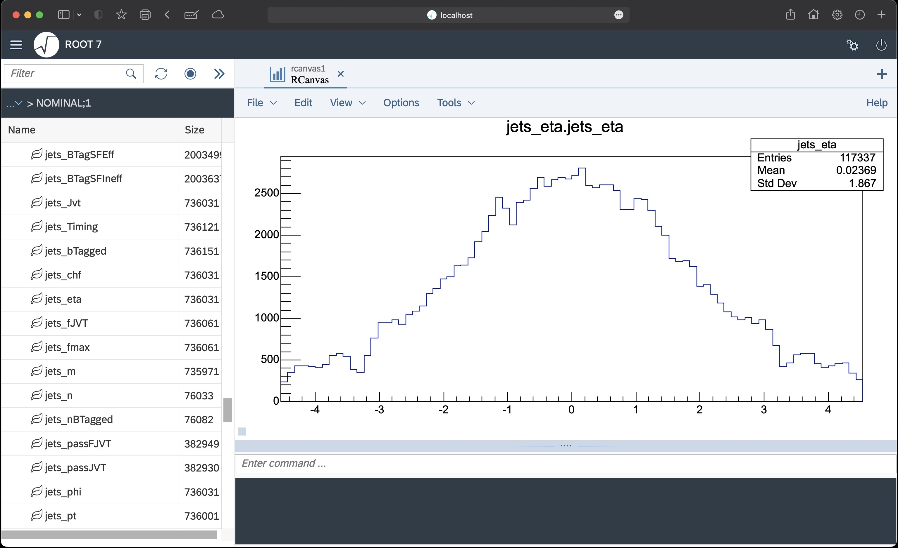

## Set up

0. Install [Docker](https://docs.docker.com/get-docker/)
1. Pull the [ROOT](https://hub.docker.com/r/rootproject/root) (rootproject/root:6.26.06-ubuntu22.04) docker image:
    ```bash
    docker pull rootproject/root:6.26.06-ubuntu22.04
    ```
2. Run the docker image:
    ```bash
    docker run -p 9200:9200 --rm -d -it -v ~/host/dir:/container/dir --name TBrowser rootproject/root:6.26.06-ubuntu22.04 root -l --web=server:9200 /opt/root/tutorials/v7/browser.cxx
    ```
    - `-p 9200:9200` maps the port 9200 of the host to the port 9200 of the container
    - `--rm` removes the container after it exits
    - `-d` runs the container in the background
    - `-it` runs the container in interactive mode
    - `-v ~/host/dir:/container/dir` mounts the host directory `~/host/dir` to the container directory `/container/dir`
    - `--name TBrowser` names the container `TBrowser`
    - `rootproject/root:latest` is the docker image
    - `root -l --web=server:9200 /opt/root/tutorials/v7/browser.cxx` runs the ROOT TBrowser in the container 
    - 
3. Open a web browser and go to [`localhost:9200/win1`](https://localhost:9200/win1) to see the TBrowser:

 

 
4. To stop the container, run:
    ```bash
    docker stop TBrowser
    ```
